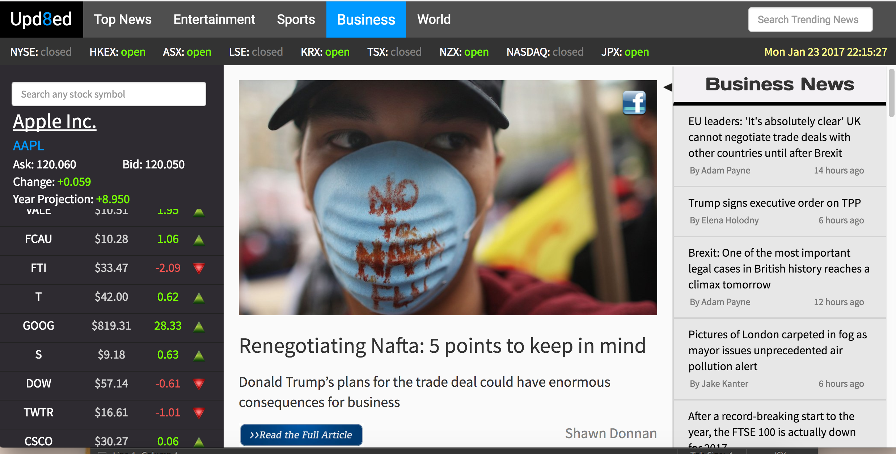
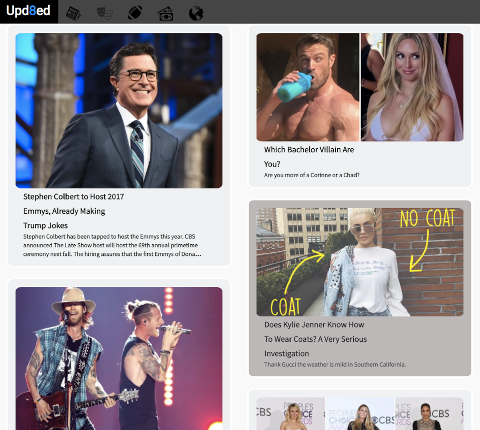
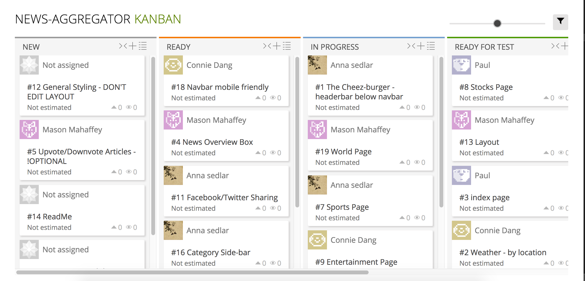

# Upd8ed: Aggregated. Upd8ed.


Video demo of site running locally.
This repo contains a clone of a project done in 2017 in a group of 4 web development students at Digital Crafts Web Development Bootcamp in Atlanta, GA. This particular clone is an attenpt to refactor the code and update dependencies in order to re-deploy to a live site.


## GitHub Link
[Upd8ed](https://github.com/mason0958/News-Aggregator)

## Code Snippets and Screenshots

Although not necessarily apparent in this screenshot, the stocks on the left side of the page are constantly being updated. Notice also that header below the nav bar displays up to date information on whether a stock market is currently open as well as the local time. 



This is accomplished by the code below:

```js

var symbol = 'BAC+FB+TSLA+WPX+WFC+RAD+FCX+AAPL+F+GE+JCP+JPM+VALE+FCAU+FTI+T+GOOG+S+DOW+TWTR+CSCO+INTC+QQQ+MU+XIV+NVDA+NFLX+JNJ+HBAN+ARRY+CMCSA+TVIX+GRPN+ARIA+MSFT+SIRI'
var stockFront = 'http://query.yahooapis.com/v1/public/yql?q=select%20*%20from%20yahoo.finance.quotes%20where%20symbol%20in%20("'
var stockTail = '")%0A%09%09&env=http%3A%2F%2Fdatatables.org%2Falltables.env&format=json'
var stockUrl = stockFront + symbol + stockTail

//parent of Stock.js, StockSearch.js, StockMarkets.js
class Stocks extends Component {
    constructor(props) {
      super(props);
      this.state = {stocks: []};
      this.componentDidMount = this.componentDidMount.bind(this);
  };
    componentDidMount() {
    $.getJSON(stockUrl, (stockData) =>{
      var stockArr = stockData.query.results.quote
      var stockArrMin = []
      for(let i = 0; i < stockArr.length; i++){
        if(stockArr[i].symbol!==null){
          if(stockArr[i].DaysHigh==null){stockArr[i].DaysHigh = "-"};
          if(stockArr[i].Change==null){stockArr[i].Change = "0"};
          // changed stock.Change to yearly change for display on weekends
          var eachStock = {
            symbol: stockArr[i].symbol,
            price: stockArr[i].LastTradePriceOnly,
            change: stockArr[i].ChangeFromFiftydayMovingAverage,
            name: stockArr[i].Name
          }
          stockArrMin.push(eachStock)
        }
      }
      this.setState({stocks: stockArrMin})
    });   
    }

    render() {
      //left column hidden in phone
      if(this.state.stocks.length > 4){
        return(
          <div>
          <StockHeader />
          <div className='hidden-sm hidden-xs'>
              <StockSearch />
              <Stock stocks={this.state.stocks} />
            </div>
          </div>
      )
    }else{
      return(
        <div>
          <StockHeader />
          <div className='blinkingLetters' style={{marginTop:35,fontSize: 30,position:'fixed',marginLeft:10}}>Loading Stocks...</div>
        </div>
      )
    }
    }
}


export default Stocks;
```

For visual appeal, we put the top ESPN news in a slider and displayed the entertainment articles in a Pinterest-inspired layout. We used [Kiran's](https://github.com/akiran) open-source slider.

```js
import SportsHome from './SportsHome';
import giveToSliderPhoto from './SportsHome';
var React = require('react');
var Slider = require('react-slick');


var SimpleSlider = React.createClass({
 render: function () {
   var settings = {
     dots: true,
     speed: 500,
     slidesToShow: 1,
     slidesToScroll: 1,
     autoplay: true,
     autoplaySpeed: 4000,
     adaptiveHeight: true,
     arrows: false,
     pauseOnHover: true,
     useCSS: true,
     centerMode: true,
     variableWidth: true
 
   };

   // console.log(this.props.articles)
   var imgURL = []
        {this.props.articles.map(function(article, index){
         imgURL.push(<div className="anna" key={index}><a target="_blank" href={article.url}>
                       </a></div>)}
       )}
   var titles = []
     {this.props.articles.map(function(article, index){
       titles.push(<div className="row slider_titles" key={index}><a target="_blank" href={article.url}>{article.title}</a></div>)
     })}

   return (
     
     <div className="slider">
       <Slider{...settings}>
         <div>
           <div >{imgURL[0]}</div>
           <div>{titles[0]}</div>
         </div>
         <div>
           <div>{imgURL[1]}</div>
           <div>{titles[1]}</div>
         </div>
         <div>
           <div>{imgURL[2]}</div>
           <div>{titles[2]}</div>
         </div>
         <div>
           <div>{imgURL[3]}</div>
           <div>{titles[3]}</div>
         </div>
         <div>
           <div>{imgURL[4]}</div>
           <div>{titles[4]}</div>
         </div>
       </Slider>
     </div>
   );
 }
});

export default SimpleSlider;
```

Entertainment page in tablet view. Notice how the icons in the links in the navbar have now changed to symbols when the size of the device has been reduced.



Want to search for specific articles anywhere on the site? Simply start typing in the search box. The articles retrieved from your query will have the word highlighted in its title. We tried searching "Trump" in the wake of the 2017 inauguration. Pretty neat!


What if you can't remember if you've read this particular article before? No worries. Once you click on an article it turns gray as demonstrated in the first three articles. There is also an option to share this article on your Facebook account.


Here is where it all happens:

```js
var readColor = 'black'
    var authorColor = 'grey'
    var keyWordColor = 'black'
    var keyBg = 'yellow'
    if(this.state.read === 'seen'){readColor='lightgrey'; authorColor='lightgrey'; keyWordColor='lightgrey'; keyBg='none'}

    return(
      <div className='click-article' onClick={this.childOnClick} style={{color:readColor, padding:'10px 20px', borderLeft:'1px solid #ddd',borderBottom:'2px solid #ddd'}}>
        <div style={{fontSize:16}}>
          <div>{this.props.frontText}
            <span style={{backgroundColor:keyBg, color:keyWordColor}}>{this.props.highlightText}</span>
            {this.props.backText}
          </div>
        </div>
        <div style={{marginLeft:2, marginTop:5, fontSize:13, color:authorColor}}>
          <div style={{float:'left'}}>{authorText}</div>
          <div style={{float:'right', marginRight:10}}>{publishText}</div>
        </div>
        <br/>
      </div>
    )
  }
}
```

This is the specific line that tells us how we mark articles as "read":

`if(this.state.read === 'seen'){readColor='lightgrey'; authorColor='lightgrey'; keyWordColor='lightgrey'; keyBg='none'}`

The layout of the world page is what we strived for in most of our pages. The 3-column layout includes a larger view of a selected article sandwiched between a region selector and a search bar.


And just to make sure our website is mobile-friendly, we tested each page by shrinking our view. This is what the Business page looks like on a mobile device. As with the entertainment page, notice how the links in the navbar have been changed to icons on smaller views.


## MVP (Minimal Viable Product)
**Top news page:** displaying the current weather and a few top news articles from each page (entertainment, sports, business and world)

**Entertainment page:** displaying the latest articles from Entertainment-Weekly, Buzzfeed, MTV, MTV-UK and Daily Mail

**Sports news:** displaying the latest articles from talkSPORT, ESPN and FOX sports.

**Business page:** displaying the latest articles from Business Insider, Financial Times, Business Insider UK, Fortune' and The Economist

**World:** displaying the latest top articles from each continent

## Stretch Goals
1. Upvote/downvote option for users
2. Option to share articles on social media
3. Backend server
4. Displaying articles in an Iframe modal

## Team Members and Contributions
All team members are full stack web development students of the [DigitalCrafts](http://www.digitalcrafts.com/) November 2016 cohort. This project utilizes our frontend skills that we have learned along with pair programming and SCRUM agile development methodology. We used Taiga to implement a Kanban task scheduling system to practice agile software development. 



## Project Timeline
* Project start: 1/18/2017
